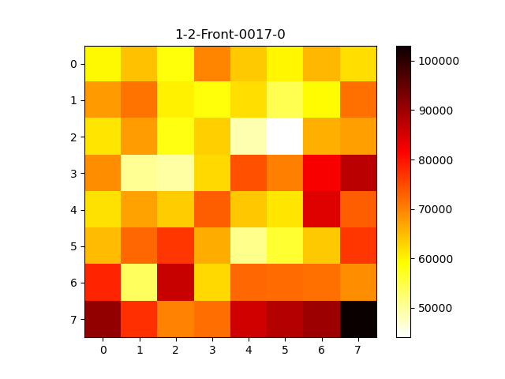
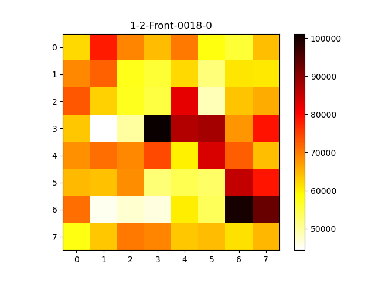
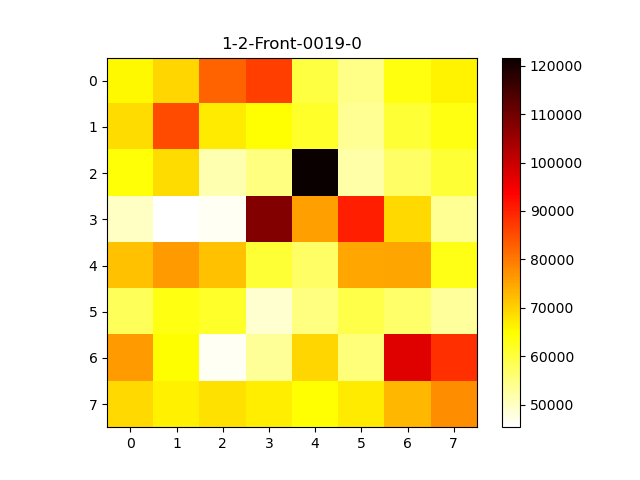
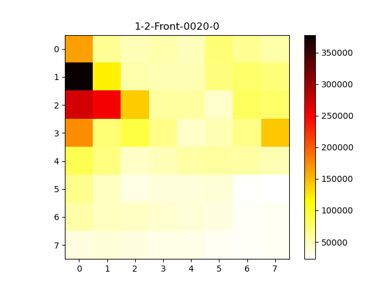
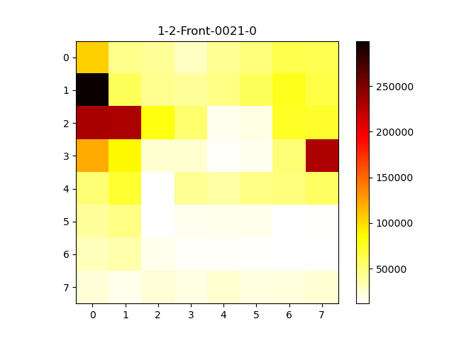

# LivePano
This repository contains supplementary experimental materials for our research project, focusing on the analysis of video bitrate fluctuations within the dataset used. These materials are primarily presented as heatmaps and line charts, designed to visually illustrate the bitrate variations for each video throughout its duration.

These supplementary figures are intended to aid in understanding specific motivation presented in our main research work.

